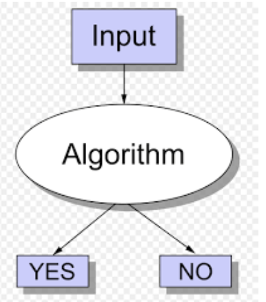

# ***Machine Learning***
## CH1 Intro of ML 02/26
- **Classification problem**

    
    - Meaning of regression
        - Determine the strengthen and character of the relationship.
    - CLassification vs regression
        - Classification: Yes or NO  
        - Regression: Input and ouput a number
    - Generative vs Discriminative
        - Generative: generative a possibility model per class
        - Discriminative: one model for two classes 
    - Supervised learning
        - Needs input and output pair
    - Unsupervised learning 
        - No output pair
        - Clustering: K-means 
        - Reduction: reduce the data
        - Generation: GPT
    - Golden rule 
        - Test samples cannot be from trainning set
        - Knowlege leak is  **not allow** (fine tune their reslt): using test sample to be trainging sample
    - Binary classification
       
    - Model complexity
        - Model with low complexity: Higher training errors
        - Model with high complexity: Lower training errors
        - Complexity measured by **VC-dimension**
    
    - K-NN classifer
    - 
        - When k = 3, star will be purple
        - When k = 6, star will be yellow

##
## VC dimension 03/04
- **Definition of VC dimension**
    - Is a number of data points N could be classificatied. 
     - 
    - 
    - **Use the retangle function to solve.**
    
    - Trainging sample should be large enough than VC dimension.
    - If the VC dimension, it would be overfitting. (Ein != Eout)
## 
## Bayesian & Naive Bayesian Decision Theory
- **Linear Classifier**

    - $f(x) = W^TX+b$
    
- **Bayes theorem**
    - $P(C|x) = \cfrac{P(C)P(x|C)}{P(x)} = \cfrac{P(C)P(x|C)}{P(x|c)*P(c)+P(x|-c)*P(-C)}$  
    - If all random variables are independent, using **Naive Bayes classifier**
- **Issue of Naive Bayes classifer**
    -  Unseen attribute values
    -  Missing value
-  **Handing missing values**
    - Using average(MLE)
    - Using regression model

## Parametric estimation

- **Maximum a Posteriori (MAP)**

    - Incorporates pior knowledge into estimation
    - $P(X|\theta) = \prod p(Xi|\theta)$
    - IF tossing a coin 5 times is H, H, T, T, H
        - P({H}) = $\theta$ = 0.01
          P = 0.1 * 0.1 * 0.9 * 0.9 * 0.1
        - P({H}) = $\theta$ = 0.02
          P = 0.2 * 0.2 * 0.8 * 0.8 * 0.2
    - It wants to find ----- $\theta map = arg maxP(\theta|X)$
    - If P(X) does not affect the max operation, only need to consider $P(X|\theta)P(\theta)$
    - P({H}) = $\theta$ is modeled as outcome from beta distribution
    
    - pdf = $f(x;a,b) = \frac{\Gamma(a+b)}{\Gamma(a)\Gamma(b)}x^(a-1)(1-x)^(b-1)$
    therefore, we need  to determine valueso of a and b.
    - If a = b, $\theta$ = 0.5
     We want to find $\theta$max = $\frac{Nh+a-1}{N+a+b-2}$
     `e.g. {H, T, H, H, T} Nh = 3, H = 5`
- **Bias and Variance**

    - Bias = $E[d(X)] - \theta$ 
    - Variance = $E[(d - E[d])^2]$
- **Mean Sequare Error (MSE)**
     - MSE = $E[(d-\theta)^2]$ = $E[(d - E[d])^2]$ + $(E[d(X)] - \theta)^2$ 
         = $Variance$ + $Bias^2$
    - 

## Feature Selection
- **Definition**
    - e.g Iris's feature is length and width of the sepals and petals
    
- **Feature selection**
    - 2 attributes, out of 4 to have higherst possible accuracy
    - Feature(a, b, c, d) -> pick (a, b)
    - Avoid curse of dimensionality
    - Enhance generalization by reducing overfitting
    - Feature Selection method
        - Filter method: Based on metrics
          e.g correlation, information gain, Chi-squared
        - Wrapper method: Based on accuracy of used classifier
          e.g. **greedy hill-climbing algorithm**
          `In iris case, feature = {a, b, c, d}.
          If {b} has best accuracy.
          Check the subsets with {b,a}, {b,c}, {b,d}`
        - Embedded method: Combing feature selection and classification in one phase
          e.g. **Lasso for regression**
        
- **Feature Extraction**
    -  Using PCA to compute a new feature vectors
    -  Feature(a, b, c, d) -> use(x, y)
       x = F(a, b, c, d), y = G(a, b, c, d)

## Decision Tree

- **Definition** 
    - Used for classification or regression
    - Many algorithms e.g ID3, C4.5
    - Can not handle continuous attributes
- **Entropy**
    - Condition which is more difficult to predict has larger entropy
    

- **ID3 Algorithm**
    - 

- **C4.5**
    - C4.5 defines gain ration function as
     $GR(S,T)= \frac{G(S,T)}{Split(T)}$, $Split(T) = -\sum Pti \ Log2Pti$
    - In C4.5, GR(S,T) is used in place of G(S,T)
    - GR(S, T) = ID3 / Split(T)
    - If GR = 1, is the max value among all GRs.
- **Tree Pruning**
    - Some training data may creates a tree that over-fits the data, thus we need to prune the tree
    - Pruning means removing some nodes
    - Usually from leaf to root
    - Prepruning: limit the number of nodes during tree generation
    - Postpruning: Cut nodes after tree generated 
    - Pessimistic pruning 
    - Pessimistic pruning
- **Random Forest**
    - A whole bunch of decision tree  
## Clustering Algorithm
- **K means**
    - https://chih-sheng-huang821.medium.com/%E6%A9%9F%E5%99%A8%E5%AD%B8%E7%BF%92-%E9%9B%86%E7%BE%A4%E5%88%86%E6%9E%90-k-means-clustering-e608a7fe1b43
    - Divided into 2 sub-problem: centroid points for each cluster is known and all observations in a cluster is known.
    - Vector Quantization (VQ)
        - For data compression: Lossing
    - We want to find
     
    - Algorithm
        1. 我們先設定好要分成多少(k)群。

        2. 然後在feature space(x軸身高和y軸體重組出來的2維空間，假設資料是d維，則會組出d維空間)隨機給k個群心。

        3. 每個資料都會所有k個群心算歐式距離(歐基李德距離Euclidean distance，其實就是直線距離公式，從小學到大的那個距離公式，這邊距離當然也可以換成別種距離公式，但基本上都還是以歐式距離為主)。

        4. 將每筆資料分類判給距離最近的那個群心。

        5. 每個群心內都會有被分類過來的資料，用這些資料更新一次新的群心。

        6. 一直重複3–5，直到所有群心不在有太大的變動(收斂)，結束。

## L18 Dimensionality reduction**
- **PCA**
    - $\Lambda = diag(\lambda1 +......, \lambda p)$
    - Let $\lambda1 >= \lambda2 >= ...... >= \lambda p$
    - Proportion of Variance(PoV) = $\frac{\lambda1 +.....+\lambda k}{\lambda1 +.....+\lambda p}$
    - Pick PoV(k) > 0.9
    - https://leemeng.tw/essence-of-principal-component-analysis.html
- **Factor analysis**
    - Exploratoey factor analysis
    - Confirmatory factor analysis
- **Independent Component Analysis(ICA)**
    - 3 Steps
        - Centering
        - Whitening
        - Max non-Gaussian
- **PCA VS ICA**
    - PCA is projection
    - ICA using distribution
    - 
- **LDA not mention**

- **Optimization & Gradinent Desent Basics**
    -  Optimization
        -  Unconstrained
            -  Ex: $min f(x,y) = 3x - y^2$
            -  local min = $f'(a0) = 0$
        -  Constrained
            -  Ex: min f(x,y) = x + y subject X^2 + y^2 = 1
## L19 Optimization And Gradient Descent
- **Optimization**
    - Closed form
    - Interative method eg. **gradient descent**
    - Randomized method
- **Unconstrained Optimization**
    - If a0 is local minimum/maximum, then $f'(a0) = 0$
    - We can find $\nabla{f(X0)} = 0$	
- **Constrained Optimization**
    - Maximize $f(x,y)$ subject to $g(x,y) = 0$

    - 
    - $\nabla{f} = \lambda \nabla{g}$ for some Lagrange multiplier
    - 
- **KKT-conditions**
    - Extended to handle multivariable functions

    - min f(x) subject to h(x) <= 0and g(x) = 0
    - Similar trick as Lagrange multipliers
    - 
    - SVM is based on KTT condition.
- **Gradient Descent Method**
    - $f(x) = w * x = w^Tx$

      If we want to find $f(x+u)$ is minimal
      and we know $f(x+u)=w^T(x+u) + b$ equals to $f(x)+w^Tx$
      Thus, $f(x+u)$ is minimal only if $u = - \frac{w}{||w||}$
    - Algorithm
        
- **Regularizatino method**
    - Avoid overfitting by using regularization
    - 讓複雜的訓練參數簡單化
    - Using L1, L2 method
    
    
    
    - L2 regularization
    

    - L1 regularization
    

## L20 Support Vector Machine
- **Binary classifiers**
    - Wan to classify test samples into 2 classes
- **Linear separability**
    - Use a linear function to separate 2 classes
    

    - It follow math form: $f(x+u)=w^Tx +b$
        b is a scalar, it called bias.
    - It can also use gradient descent method to find W
    - Closest to decision boundary(W) are **support vectors**. And we want to find "good" W.
    
- **Soft margin solution**
    - If there is non-separable dataset
    
    - If $\xi >= 0$, add penalty in the cost function
    - And the new optimization problem becomes
    
    - Large C implies stronger "margin" requirement
      Small C allows soft "margin"
    

- **Hinge (loss) function**
    -  If $\xi$ appears only if data points does not have enough marine
    - Max function as $\xi = max(0, \Delta-d(k)y(k))$
      we can consider some cases: $\Delta=1$ or $\Delta=0$
    
    
- **Kernel tricks**
    - Transform into higher dimensional space
    - 
- **Dual form**
- **Radical basis function**
    - TBD
## L22 Back Propagation
